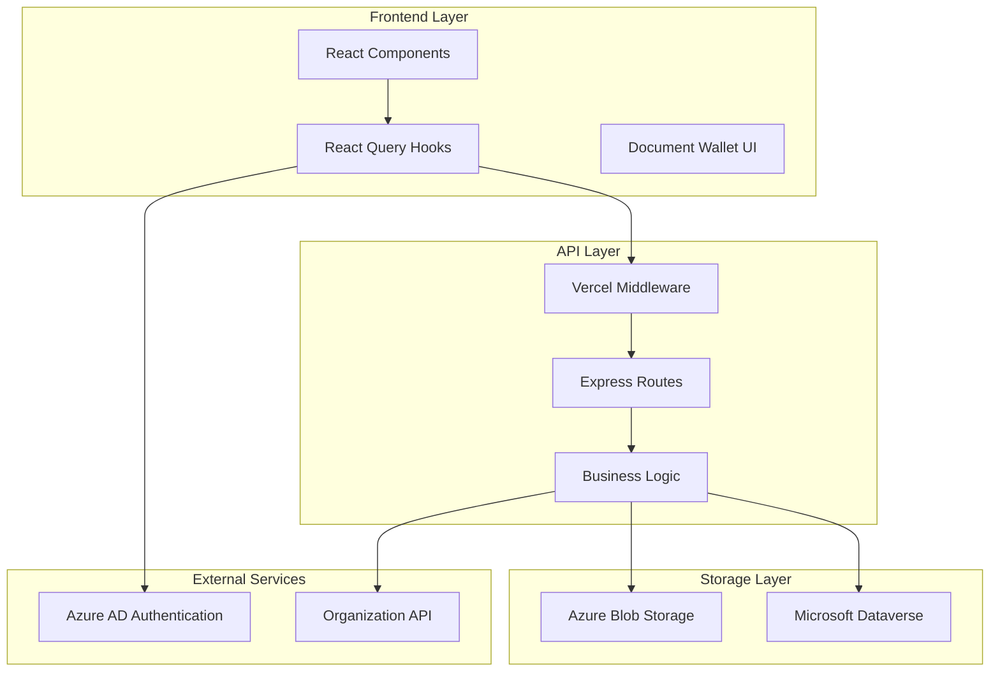

# Design Document: Document Wallet

## Overview

The Document Wallet is a comprehensive document management system built with a modern React frontend, Node.js backend, and cloud-native storage architecture. The system provides secure document storage, version control, expiration tracking, and role-based access control for enterprise organizations.

The architecture follows a three-tier pattern with clear separation of concerns:
- **Frontend**: React components with React Query for state management
- **API Layer**: Express.js middleware with Vercel proxy for serverless deployment
- **Storage Layer**: Azure Blob Storage for files and Microsoft Dataverse for metadata

## Architecture

### High-Level Architecture



### Component Architecture

The system is organized into distinct layers with clear responsibilities:

**Frontend Components:**
- `DocumentWallet.tsx` - Main container with search, filters, and refresh functionality
- `DocumentDashboard.tsx` - Summary tiles and statistics display
- `DocumentTable.tsx` - Document listing with sorting and filtering
- `DocumentUpload.tsx` - File upload modal with progress tracking
- `DocumentDetail.tsx` - Document details and version history
- `DocumentNotification.tsx` - Expiring document notifications

**API Middleware:**
- Document CRUD operations with proper HTTP methods
- File upload handling with multipart/form-data support
- Secure download URL generation with SAS tokens
- Organization-scoped data access

**Business Logic Services:**
- Version number calculation and management
- Document status computation based on expiration dates
- Organization ID extraction and caching
- Security and permission validation

## Components and Interfaces

### Frontend Components

#### DocumentWallet Component
```typescript
interface DocumentWalletProps {
  organizationId: string;
}

interface DocumentWalletState {
  searchTerm: string;
  categoryFilter: string;
  statusFilter: DocumentStatus;
  isRefreshing: boolean;
}
```

The main container component integrates React Query for data fetching, implements search and filtering functionality, and manages the overall document wallet state.

#### DocumentUpload Component
```typescript
interface DocumentUploadProps {
  isOpen: boolean;
  onClose: () => void;
  onUploadComplete: () => void;
}

interface UploadFormData {
  title: string;
  category: string;
  expirationDate: Date;
  confidentialityLevel: 'Public' | 'Internal' | 'Confidential';
  file: File;
}
```

Handles file uploads with validation, progress tracking, and multipart/form-data submission to the backend API.

#### DocumentTable Component
```typescript
interface DocumentTableProps {
  documents: Document[];
  isLoading: boolean;
  onSort: (field: string, direction: 'asc' | 'desc') => void;
  onFilter: (filters: DocumentFilters) => void;
}

interface Document {
  id: string;
  title: string;
  category: string;
  status: DocumentStatus;
  expirationDate: Date;
  currentVersion: number;
  createdDate: Date;
  modifiedDate: Date;
}
```

### API Interfaces

#### Document API Endpoints
```typescript
// GET /api/v1/documents
interface GetDocumentsQuery {
  search?: string;
  category?: string;
  status?: DocumentStatus;
  page?: number;
  limit?: number;
}

interface GetDocumentsResponse {
  documents: Document[];
  totalCount: number;
  page: number;
  totalPages: number;
}

// POST /api/v1/documents
interface CreateDocumentRequest {
  title: string;
  category: string;
  expirationDate: string;
  confidentialityLevel: string;
  file: File; // multipart/form-data
}

interface CreateDocumentResponse {
  document: Document;
  version: DocumentVersion;
}
```

#### Version Management
```typescript
interface DocumentVersion {
  id: string;
  documentId: string;
  versionNumber: number;
  fileName: string;
  fileSize: number;
  createdDate: Date;
  createdBy: string;
  blobPath: string;
}

interface CreateVersionRequest {
  file: File; // multipart/form-data
}

interface DownloadVersionResponse {
  downloadUrl: string; // SAS URL
  expiresAt: Date;
}
```

### React Query Hooks

#### Document Management Hooks
```typescript
// Query hooks for data fetching
const useDocumentsQuery = (filters: DocumentFilters) => {
  return useQuery({
    queryKey: ['documents', filters],
    queryFn: () => fetchDocuments(filters),
    staleTime: 5 * 60 * 1000, // 5 minutes
  });
};

const useDocumentDetails = (documentId: string) => {
  return useQuery({
    queryKey: ['document', documentId],
    queryFn: () => fetchDocumentDetails(documentId),
    enabled: !!documentId,
  });
};

const useDocumentVersions = (documentId: string) => {
  return useQuery({
    queryKey: ['documentVersions', documentId],
    queryFn: () => fetchDocumentVersions(documentId),
    enabled: !!documentId,
  });
};

// Mutation hooks for data modification
const useCreateDocument = () => {
  const queryClient = useQueryClient();
  
  return useMutation({
    mutationFn: createDocument,
    onSuccess: () => {
      queryClient.invalidateQueries({ queryKey: ['documents'] });
      queryClient.invalidateQueries({ queryKey: ['dashboard'] });
    },
  });
};

const useDeleteDocument = () => {
  const queryClient = useQueryClient();
  
  return useMutation({
    mutationFn: deleteDocument,
    onSuccess: () => {
      queryClient.invalidateQueries({ queryKey: ['documents'] });
      queryClient.invalidateQueries({ queryKey: ['dashboard'] });
    },
  });
};
```

#### Specialized Hooks
```typescript
const useExpiringDocuments = () => {
  return useQuery({
    queryKey: ['expiringDocuments'],
    queryFn: fetchExpiringDocuments,
    refetchInterval: 5 * 60 * 1000, // Auto-refresh every 5 minutes
  });
};
```

## Data Models

### Document Entity
```typescript
interface Document {
  id: string;
  title: string;
  category: string;
  description?: string;
  expirationDate: Date;
  confidentialityLevel: 'Public' | 'Internal' | 'Confidential';
  status: DocumentStatus; // Calculated field
  currentVersionId: string;
  currentVersionNumber: number;
  organizationId: string;
  createdBy: string;
  createdDate: Date;
  modifiedBy: string;
  modifiedDate: Date;
  
  // Navigation properties
  versions: DocumentVersion[];
  organization: Organization;
}

type DocumentStatus = 'Active' | 'Pending Renewal' | 'Expired';
```

### Document Version Entity
```typescript
interface DocumentVersion {
  id: string;
  documentId: string;
  versionNumber: number;
  fileName: string;
  originalFileName: string;
  fileSize: number;
  mimeType: string;
  blobPath: string;
  checksum?: string;
  createdBy: string;
  createdDate: Date;
  
  // Navigation properties
  document: Document;
}
```

### Organization Entity
```typescript
interface Organization {
  id: string;
  name: string;
  domain: string;
  isActive: boolean;
  
  // Navigation properties
  documents: Document[];
}
```

### DTO Mapping

#### Dataverse to Frontend Mapping
```typescript
interface DataverseDocument {
  kf_documentid: string;
  kf_title: string;
  kf_category: string;
  kf_description?: string;
  kf_expirationdate: string;
  kf_confidentialitylevel: number;
  kf_currentversionnumber: number;
  '_kf_account_value': string;
  createdon: string;
  modifiedon: string;
  // ... other Dataverse fields
}

const mapDataverseToDocument = (dvDoc: DataverseDocument): Document => {
  return {
    id: dvDoc.kf_documentid,
    title: dvDoc.kf_title,
    category: dvDoc.kf_category,
    description: dvDoc.kf_description,
    expirationDate: new Date(dvDoc.kf_expirationdate),
    confidentialityLevel: mapConfidentialityLevel(dvDoc.kf_confidentialitylevel),
    currentVersionNumber: dvDoc.kf_currentversionnumber,
    organizationId: dvDoc._kf_account_value,
    createdDate: new Date(dvDoc.createdon),
    modifiedDate: new Date(dvDoc.modifiedon),
    status: calculateDocumentStatus(new Date(dvDoc.kf_expirationdate)),
    // ... other mapped fields
  };
};
```

## Business Logic

### Version Number Calculation
```typescript
const calculateNextVersionNumber = async (documentId: string): Promise<number> => {
  try {
    const versions = await dataverseService.getDocumentVersions(documentId);
    if (!versions || versions.length === 0) {
      return 1;
    }
    
    const maxVersion = Math.max(...versions.map(v => v.versionNumber));
    return maxVersion + 1;
  } catch (error) {
    // Handle missing kf_documentversions table gracefully
    if (error.message.includes('kf_documentversions')) {
      return 1;
    }
    throw error;
  }
};
```

### Document Status Calculation
```typescript
const calculateDocumentStatus = (expirationDate: Date): DocumentStatus => {
  const now = new Date();
  const daysDiff = Math.ceil((expirationDate.getTime() - now.getTime()) / (1000 * 60 * 60 * 24));
  
  if (daysDiff < 0) {
    return 'Expired';
  } else if (daysDiff <= 30) {
    return 'Pending Renewal';
  } else {
    return 'Active';
  }
};
```

### Organization ID Extraction
```typescript
const extractOrgIdFromToken = async (token: string): Promise<string> => {
  // Try to extract from JWT token first
  try {
    const decoded = jwt.decode(token) as any;
    if (decoded?.orgId) {
      return decoded.orgId;
    }
  } catch (error) {
    // Token decode failed, continue to API fallback
  }
  
  // Fallback to API call with caching
  const cacheKey = `orgId_${token}`;
  let orgId = cache.get(cacheKey);
  
  if (!orgId) {
    const response = await fetch('/api/user/organization', {
      headers: { Authorization: `Bearer ${token}` }
    });
    const data = await response.json();
    orgId = data.organizationId;
    
    // Cache for 1 hour
    cache.set(cacheKey, orgId, 3600);
  }
  
  return orgId;
};
```

### Blob Storage Path Generation
```typescript
const generateBlobPath = (orgId: string, documentId: string, versionNumber: number, fileName: string): string => {
  return `org/${orgId}/documents/${documentId}/v${versionNumber}/${fileName}`;
};
```

### SAS URL Generation
```typescript
const generateSasUrl = async (blobPath: string, confidentialityLevel: string): Promise<string> => {
  const expiryMinutes = confidentialityLevel === 'Confidential' ? 15 : 60;
  const expiryTime = new Date(Date.now() + expiryMinutes * 60 * 1000);
  
  return await blobService.generateSasUrl(blobPath, {
    permissions: 'r', // Read only
    expiresOn: expiryTime,
  });
};
```

## Security and Authentication

### JWT Token Validation
```typescript
const validateJwtToken = (token: string): Promise<JwtPayload> => {
  return new Promise((resolve, reject) => {
    jwt.verify(token, process.env.JWT_SECRET, (err, decoded) => {
      if (err) {
        reject(new Error('Invalid token'));
      } else {
        resolve(decoded as JwtPayload);
      }
    });
  });
};
```

### Role-Based Access Control
```typescript
const checkPermissions = async (userId: string, action: string, resourceType: string): Promise<boolean> => {
  try {
    const userRoles = await getUserRoles(userId);
    const requiredPermissions = getRequiredPermissions(action, resourceType);
    
    return userRoles.some(role => 
      requiredPermissions.every(permission => 
        role.permissions.includes(permission)
      )
    );
  } catch (error) {
    // Default to deny access on error
    return false;
  }
};
```

### Organization Scoping Middleware
```typescript
const organizationScopingMiddleware = async (req: Request, res: Response, next: NextFunction) => {
  try {
    const token = req.headers.authorization?.replace('Bearer ', '');
    if (!token) {
      return res.status(401).json({ error: 'No token provided' });
    }
    
    const orgId = await extractOrgIdFromToken(token);
    req.organizationId = orgId;
    
    next();
  } catch (error) {
    res.status(401).json({ error: 'Invalid token or organization' });
  }
};
```

Now I need to use the prework tool to analyze the acceptance criteria before writing the correctness properties section.

<function_calls>
<invoke name="prework">
<parameter name="featureName">document-wallet

## Correctness Properties

*A property is a characteristic or behavior that should hold true across all valid executions of a system—essentially, a formal statement about what the system should do. Properties serve as the bridge between human-readable specifications and machine-verifiable correctness guarantees.*

Based on the prework analysis, I've identified several key properties that need to be validated through property-based testing. After reviewing for redundancy, the following properties provide comprehensive coverage without overlap:

### Property 1: Organization Scoping Consistency
*For any* user and document set, when filtering documents by organization, all returned documents should belong to that user's organization and no documents from other organizations should be included.
**Validates: Requirements 1.1, 6.4**

### Property 2: Search and Filter Correctness
*For any* search term and document collection, when applying search filters, all returned documents should match the search criteria (title or category contains the search term) and all matching documents should be included.
**Validates: Requirements 1.2, 1.3**

### Property 3: Status Filter Accuracy
*For any* document set and status filter, when filtering by status, all returned documents should have the specified calculated status and no documents with different statuses should be included.
**Validates: Requirements 1.4, 4.5**

### Property 4: File Upload Validation
*For any* file input, when validating uploads, files that don't meet format or size requirements should be rejected, and valid files should be accepted.
**Validates: Requirements 2.1**

### Property 5: Document Creation Consistency
*For any* valid document metadata, when creating a document, it should be stored with version number 1 and the correct blob storage path format org/{orgId}/documents/{documentId}/v1/{filename}.
**Validates: Requirements 2.3, 2.4**

### Property 6: Version Number Calculation
*For any* document with existing versions, when creating a new version, the version number should be exactly one greater than the maximum existing version number.
**Validates: Requirements 3.1**

### Property 7: Version Storage Path Consistency
*For any* document version, the blob storage path should follow the format org/{orgId}/documents/{documentId}/v{versionNumber}/{filename} where all components match the document and version metadata.
**Validates: Requirements 3.2, 15.1**

### Property 8: Document Status Calculation
*For any* document with an expiration date, the calculated status should be "Expired" if the date has passed, "Pending Renewal" if within 30 days, and "Active" if more than 30 days away.
**Validates: Requirements 4.1, 4.2, 4.3**

### Property 9: SAS URL Expiry Rules
*For any* document, when generating SAS URLs, confidential documents should have 15-minute expiry times and non-confidential documents should have standard expiry times.
**Validates: Requirements 5.2, 5.3, 15.4**

### Property 10: Permission Validation
*For any* user and document operation, when checking permissions, unauthorized operations should be blocked and authorized operations should be allowed based on the user's role.
**Validates: Requirements 5.4, 7.2, 7.3, 10.3**

### Property 11: Organization ID Extraction Priority
*For any* JWT token, when extracting organization ID, the system should first attempt to get it from the token, and only call the API if the token doesn't contain the organization ID.
**Validates: Requirements 6.1, 6.2**

### Property 12: Account Relationship Format
*For any* document creation, when associating with an organization, the system should use the kf_Account@odata.bind format correctly.
**Validates: Requirements 6.5, 12.3**

### Property 13: Dashboard Count Accuracy
*For any* document set, when calculating dashboard statistics, the total count and status-based counts should exactly match the actual number of documents in each category.
**Validates: Requirements 8.1, 8.2, 8.3**

### Property 14: Expiring Document Identification
*For any* document collection, when identifying expiring documents, all and only documents with expiration dates within 30 days should be included in the results.
**Validates: Requirements 9.1**

### Property 15: Document Deletion Completeness
*For any* document, when deletion is performed, all associated versions should be removed from blob storage and all metadata should be removed from Dataverse.
**Validates: Requirements 10.1, 10.2, 15.5**

### Property 16: Error Handling Resilience
*For any* system operation, when the kf_documentversions table is missing or other expected resources are unavailable, the system should handle the error gracefully without crashing.
**Validates: Requirements 11.1**

### Property 17: Data Mapping Round Trip
*For any* valid document object, when converting from frontend DTO to Dataverse format and back to frontend DTO, the result should be equivalent to the original object.
**Validates: Requirements 12.1, 12.2, 12.4, 12.5**

### Property 18: API Endpoint Functionality
*For any* valid API request, when calling document endpoints with proper parameters, the response should contain the correct data and follow the expected format.
**Validates: Requirements 14.1, 14.2, 14.3, 14.4, 14.5, 14.6, 14.7**

### Property 19: SAS URL Time Limitation
*For any* generated SAS URL, when creating download links, all URLs should have expiration times set and should not be accessible after expiration.
**Validates: Requirements 15.3**

## Error Handling

### Graceful Degradation
The system implements comprehensive error handling to ensure resilience:

**Missing Table Handling:**
```typescript
const handleMissingVersionsTable = async (documentId: string): Promise<DocumentVersion[]> => {
  try {
    return await dataverseService.getDocumentVersions(documentId);
  } catch (error) {
    if (error.message.includes('kf_documentversions')) {
      // Table doesn't exist, return empty array
      console.warn('Document versions table not found, returning empty versions');
      return [];
    }
    throw error; // Re-throw other errors
  }
};
```

**API Error Handling:**
```typescript
const handleApiError = (error: any): ApiError => {
  if (error.response) {
    // Server responded with error status
    return {
      type: 'API_ERROR',
      message: error.response.data?.message || 'Server error occurred',
      statusCode: error.response.status,
    };
  } else if (error.request) {
    // Network error
    return {
      type: 'NETWORK_ERROR',
      message: 'Unable to connect to server. Please check your connection.',
    };
  } else {
    // Other error
    return {
      type: 'UNKNOWN_ERROR',
      message: 'An unexpected error occurred',
    };
  }
};
```

**Validation Error Handling:**
```typescript
const validateDocumentInput = (input: CreateDocumentRequest): ValidationResult => {
  const errors: ValidationError[] = [];
  
  if (!input.title?.trim()) {
    errors.push({ field: 'title', message: 'Title is required' });
  }
  
  if (!input.category?.trim()) {
    errors.push({ field: 'category', message: 'Category is required' });
  }
  
  if (!input.expirationDate) {
    errors.push({ field: 'expirationDate', message: 'Expiration date is required' });
  } else if (new Date(input.expirationDate) <= new Date()) {
    errors.push({ field: 'expirationDate', message: 'Expiration date must be in the future' });
  }
  
  if (!input.file) {
    errors.push({ field: 'file', message: 'File is required' });
  } else if (input.file.size > MAX_FILE_SIZE) {
    errors.push({ field: 'file', message: `File size must be less than ${MAX_FILE_SIZE / 1024 / 1024}MB` });
  }
  
  return {
    isValid: errors.length === 0,
    errors,
  };
};
```

### Retry Mechanisms
```typescript
const retryWithBackoff = async <T>(
  operation: () => Promise<T>,
  maxRetries: number = 3,
  baseDelay: number = 1000
): Promise<T> => {
  for (let attempt = 1; attempt <= maxRetries; attempt++) {
    try {
      return await operation();
    } catch (error) {
      if (attempt === maxRetries) {
        throw error;
      }
      
      const delay = baseDelay * Math.pow(2, attempt - 1);
      await new Promise(resolve => setTimeout(resolve, delay));
    }
  }
  
  throw new Error('Max retries exceeded');
};
```

## Testing Strategy

### Dual Testing Approach

The Document Wallet employs a comprehensive testing strategy that combines unit testing and property-based testing to ensure both specific functionality and universal correctness properties.

**Unit Testing Focus:**
- Specific examples and edge cases
- Integration points between components
- Error conditions and boundary cases
- UI component behavior and user interactions
- API endpoint responses for known inputs

**Property-Based Testing Focus:**
- Universal properties that hold for all inputs
- Data transformation and mapping consistency
- Business logic correctness across all scenarios
- Security and permission validation
- Comprehensive input coverage through randomization

### Property-Based Testing Configuration

**Library Selection:** The system uses `fast-check` for TypeScript/JavaScript property-based testing, which provides excellent integration with Jest and comprehensive generator support.

**Test Configuration:**
- Minimum 100 iterations per property test to ensure thorough coverage
- Each property test references its corresponding design document property
- Tag format: **Feature: document-wallet, Property {number}: {property_text}**

**Example Property Test:**
```typescript
describe('Document Wallet Properties', () => {
  test('Property 1: Organization Scoping Consistency', () => {
    fc.assert(fc.property(
      fc.array(documentGenerator),
      fc.string(),
      (documents, organizationId) => {
        // Feature: document-wallet, Property 1: Organization Scoping Consistency
        const filtered = filterDocumentsByOrganization(documents, organizationId);
        return filtered.every(doc => doc.organizationId === organizationId);
      }
    ), { numRuns: 100 });
  });
  
  test('Property 8: Document Status Calculation', () => {
    fc.assert(fc.property(
      fc.date(),
      fc.date(),
      (expirationDate, currentDate) => {
        // Feature: document-wallet, Property 8: Document Status Calculation
        const status = calculateDocumentStatus(expirationDate, currentDate);
        const daysDiff = Math.ceil((expirationDate.getTime() - currentDate.getTime()) / (1000 * 60 * 60 * 24));
        
        if (daysDiff < 0) {
          return status === 'Expired';
        } else if (daysDiff <= 30) {
          return status === 'Pending Renewal';
        } else {
          return status === 'Active';
        }
      }
    ), { numRuns: 100 });
  });
});
```

### Unit Testing Strategy

**Component Testing:**
```typescript
describe('DocumentUpload Component', () => {
  test('should validate required fields', () => {
    const { getByText, getByLabelText } = render(<DocumentUpload />);
    
    fireEvent.click(getByText('Upload'));
    
    expect(getByText('Title is required')).toBeInTheDocument();
    expect(getByText('Category is required')).toBeInTheDocument();
  });
  
  test('should show upload progress', async () => {
    const mockFile = new File(['content'], 'test.pdf', { type: 'application/pdf' });
    const { getByLabelText, getByText } = render(<DocumentUpload />);
    
    fireEvent.change(getByLabelText('File'), { target: { files: [mockFile] } });
    fireEvent.click(getByText('Upload'));
    
    await waitFor(() => {
      expect(getByText(/Uploading/)).toBeInTheDocument();
    });
  });
});
```

**API Testing:**
```typescript
describe('Document API', () => {
  test('should create document with correct metadata', async () => {
    const documentData = {
      title: 'Test Document',
      category: 'Policy',
      expirationDate: '2024-12-31',
      confidentialityLevel: 'Internal',
    };
    
    const response = await request(app)
      .post('/api/v1/documents')
      .field('title', documentData.title)
      .field('category', documentData.category)
      .attach('file', Buffer.from('test content'), 'test.pdf');
    
    expect(response.status).toBe(201);
    expect(response.body.document.title).toBe(documentData.title);
    expect(response.body.version.versionNumber).toBe(1);
  });
});
```

### Integration Testing

**End-to-End Workflow Testing:**
```typescript
describe('Document Management Workflow', () => {
  test('complete document lifecycle', async () => {
    // Create document
    const createResponse = await createDocument(testDocumentData);
    expect(createResponse.status).toBe(201);
    
    // Add version
    const versionResponse = await addDocumentVersion(createResponse.body.document.id, newVersionFile);
    expect(versionResponse.body.version.versionNumber).toBe(2);
    
    // Download version
    const downloadResponse = await downloadDocumentVersion(createResponse.body.document.id, 2);
    expect(downloadResponse.body.downloadUrl).toBeDefined();
    
    // Delete document
    const deleteResponse = await deleteDocument(createResponse.body.document.id);
    expect(deleteResponse.status).toBe(204);
  });
});
```

This comprehensive testing strategy ensures that the Document Wallet maintains high quality and reliability across all functionality while providing confidence in both specific use cases and general system behavior.