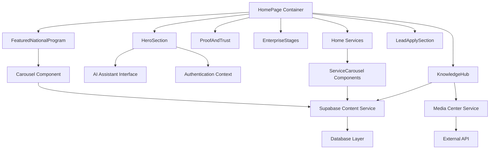
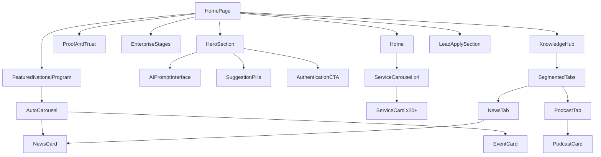

# Design Document

## Overview

The Home Page feature is implemented as a React-based single-page application that serves as the primary entry point for the DQ Intranet platform. The design follows a modular component architecture with clear separation of concerns between presentation, data fetching, and state management. The page integrates multiple external services while providing graceful fallbacks and optimal user experience across devices.

## Architecture

### High-Level Architecture



### Component Hierarchy



## Components and Interfaces

### Core Components

#### HomePage Container
```typescript
interface HomePageProps {
  // No props - top-level container
}

interface HomePageState {
  loading: boolean;
  error: string | null;
  contentSections: ContentSection[];
}
```

#### HeroSection Component
```typescript
interface HeroSectionProps {
  isAuthenticated: boolean;
  onChatOpen: () => void;
  onSearchFallback: (query: string) => void;
}

interface AIPromptInterface {
  suggestions: string[];
  onSuggestionClick: (suggestion: string) => void;
  onPromptSubmit: (prompt: string) => void;
}
```

#### Service Components
```typescript
interface ServiceCard {
  id: string;
  title: string;
  description: string;
  category: ServiceCategory;
  status: 'active' | 'coming_soon';
  navigationUrl: string;
  iconUrl?: string;
}

interface ServiceCarouselProps {
  category: ServiceCategory;
  services: ServiceCard[];
  loading: boolean;
  error?: string;
}

enum ServiceCategory {
  LEARNING_CENTER = 'learning_center',
  MEDIA_HUB = 'media_hub',
  SERVICE_REQUESTS = 'service_requests',
  ORGANIZATION = 'organization'
}
```

#### Content Components
```typescript
interface NewsItem {
  id: string;
  title: string;
  description: string;
  publishedDate: Date;
  imageUrl?: string;
  externalUrl: string;
  source: 'media_center' | 'supabase';
}

interface EventItem {
  id: string;
  title: string;
  description: string;
  eventDate: Date;
  location?: string;
  registrationUrl?: string;
}

interface Story {
  id: string;
  content: string;
  authorName: string;
  authorRole: string;
  imageUrl?: string;
}
```

#### Journey Components
```typescript
interface JourneyStep {
  id: string;
  title: string;
  description: string;
  stage: number;
  resources: Resource[];
  requirements: string[];
}

interface JourneyModalProps {
  step: JourneyStep;
  isOpen: boolean;
  onClose: () => void;
  userProgress?: number;
}
```

### Data Service Interfaces

#### Home Content Service
```typescript
interface HomeContentService {
  fetchServicesByCategory(category: ServiceCategory): Promise<ServiceCard[]>;
  fetchStories(): Promise<Story[]>;
  fetchNews(): Promise<NewsItem[]>;
  fetchEvents(): Promise<EventItem[]>;
  fetchJourneys(): Promise<JourneyStep[]>;
  searchContent(query: string): Promise<SearchResult[]>;
}

interface SearchResult {
  id: string;
  title: string;
  type: 'service' | 'news' | 'event' | 'story';
  relevanceScore: number;
  navigationUrl: string;
}
```

#### Media Center Service
```typescript
interface MediaCenterService {
  fetchNews(limit?: number): Promise<NewsItem[]>;
  fetchPodcasts(limit?: number): Promise<PodcastItem[]>;
  isAvailable(): Promise<boolean>;
}

interface PodcastItem {
  id: string;
  title: string;
  description: string;
  duration: number;
  publishedDate: Date;
  audioUrl: string;
  thumbnailUrl?: string;
}
```

### Animation and Interaction Interfaces

#### Animation Utilities
```typescript
interface AnimationConfig {
  duration: number;
  easing: string;
  delay?: number;
  respectMotionPreferences: boolean;
}

interface CounterAnimation {
  startValue: number;
  endValue: number;
  duration: number;
  formatter?: (value: number) => string;
}
```

#### Carousel Controls
```typescript
interface CarouselState {
  currentIndex: number;
  isAutoPlaying: boolean;
  items: CarouselItem[];
}

interface CarouselControls {
  next: () => void;
  previous: () => void;
  goTo: (index: number) => void;
  pause: () => void;
  resume: () => void;
}
```

## Data Models

### Database Schema (Supabase)

#### ServiceCards Table
```sql
CREATE TABLE service_cards (
  id UUID PRIMARY KEY DEFAULT gen_random_uuid(),
  title VARCHAR(255) NOT NULL,
  description TEXT,
  category service_category NOT NULL,
  status service_status DEFAULT 'active',
  navigation_url VARCHAR(500),
  icon_url VARCHAR(500),
  sort_order INTEGER DEFAULT 0,
  created_at TIMESTAMP DEFAULT NOW(),
  updated_at TIMESTAMP DEFAULT NOW()
);
```

#### Stories Table
```sql
CREATE TABLE stories (
  id UUID PRIMARY KEY DEFAULT gen_random_uuid(),
  content TEXT NOT NULL,
  author_name VARCHAR(255) NOT NULL,
  author_role VARCHAR(255),
  image_url VARCHAR(500),
  is_featured BOOLEAN DEFAULT FALSE,
  created_at TIMESTAMP DEFAULT NOW(),
  updated_at TIMESTAMP DEFAULT NOW()
);
```

#### News Items Table
```sql
CREATE TABLE news_items (
  id UUID PRIMARY KEY DEFAULT gen_random_uuid(),
  title VARCHAR(255) NOT NULL,
  description TEXT,
  published_date TIMESTAMP NOT NULL,
  image_url VARCHAR(500),
  external_url VARCHAR(500),
  source VARCHAR(50) DEFAULT 'supabase',
  is_featured BOOLEAN DEFAULT FALSE,
  created_at TIMESTAMP DEFAULT NOW()
);
```

#### Journey Steps Table
```sql
CREATE TABLE journey_steps (
  id UUID PRIMARY KEY DEFAULT gen_random_uuid(),
  title VARCHAR(255) NOT NULL,
  description TEXT NOT NULL,
  stage INTEGER NOT NULL,
  resources JSONB DEFAULT '[]',
  requirements TEXT[],
  sort_order INTEGER DEFAULT 0,
  created_at TIMESTAMP DEFAULT NOW(),
  updated_at TIMESTAMP DEFAULT NOW()
);
```

### API Response Models

#### Media Center API Response
```typescript
interface MediaCenterResponse {
  success: boolean;
  data: {
    articles: MediaCenterArticle[];
    podcasts: MediaCenterPodcast[];
  };
  pagination?: {
    page: number;
    limit: number;
    total: number;
  };
}

interface MediaCenterArticle {
  id: string;
  headline: string;
  summary: string;
  published_at: string;
  image_url?: string;
  article_url: string;
}
```

## Correctness Properties

*A property is a characteristic or behavior that should hold true across all valid executions of a system-essentially, a formal statement about what the system should do. Properties serve as the bridge between human-readable specifications and machine-verifiable correctness guarantees.*

Now I'll analyze the acceptance criteria to determine which can be tested as properties:

<function_calls>
<invoke name="prework">
<parameter name="featureName">home-page

Based on the prework analysis, I'll now convert the testable acceptance criteria into formal correctness properties:

### Property 1: Authentication State Rendering
*For any* authentication state (authenticated/unauthenticated), the system should display the appropriate CTAs and content sections that match that authentication level
**Validates: Requirements 1.3, 1.4, 10.1, 10.2**

### Property 2: Suggestion Pill Interaction
*For any* suggestion pill with text content, clicking it should populate the AI prompt input field with that exact suggestion text
**Validates: Requirements 1.5**

### Property 3: Animation Preference Respect
*For any* user preference setting regarding motion/animations, all animated elements should respect that preference by either enabling or disabling animations accordingly
**Validates: Requirements 1.7, 3.5, 4.5, 8.5**

### Property 4: Carousel Auto-Advancement
*For any* carousel with available content, the carousel should auto-advance to the next item every 5 seconds when not manually controlled
**Validates: Requirements 2.2**

### Property 5: Manual Carousel Control
*For any* carousel interaction (next, previous, pause), the auto-advancement should pause and allow manual navigation control
**Validates: Requirements 2.3**

### Property 6: Content Item Required Fields
*For any* content item displayed (carousel items, news, podcasts, journey steps), the rendered output should contain all required fields (title, description, navigation links, dates where applicable)
**Validates: Requirements 2.5, 4.3, 6.5**

### Property 7: Conditional Content Display
*For any* data availability state (testimonials present/absent, partner info present/absent), the system should only display content sections when the corresponding data is available
**Validates: Requirements 3.3, 3.4**

### Property 8: Journey Stage Interaction
*For any* journey stage, clicking it should open a modal containing the stage's detailed information (description, resources, next steps)
**Validates: Requirements 4.2**

### Property 9: User Progress Indication
*For any* user with available progress data, the journey timeline should visually indicate the user's current stage position
**Validates: Requirements 4.4**

### Property 10: Service Organization and Status
*For any* service card, it should be correctly categorized under its designated hub and display the appropriate status indicator (active/coming soon)
**Validates: Requirements 5.2, 5.3**

### Property 11: Service Navigation
*For any* service card click, the system should navigate to the correct destination (internal page or external link) based on the service's navigation configuration
**Validates: Requirements 5.4**

### Property 12: Service Counter Display
*For any* service category with a count of available services, the category header should display an animated counter showing the correct number
**Validates: Requirements 5.5**

### Property 13: Form Validation and Error Handling
*For any* form submission with invalid data, the system should display clear, specific error messages and prevent submission until validation passes
**Validates: Requirements 7.2, 7.4**

### Property 14: Responsive Layout Adaptation
*For any* viewport size change, all components should adapt their layout appropriately for the target screen size and interaction method (touch/mouse)
**Validates: Requirements 8.1**

### Property 15: Keyboard Navigation and Accessibility
*For any* interactive element, it should be accessible via keyboard navigation with proper focus management and include appropriate ARIA labels for screen readers
**Validates: Requirements 8.3, 8.4**

### Property 16: Service Timeout and Error Handling
*For any* external service call that times out or fails, the system should implement appropriate timeout handling and gracefully degrade to fallback content
**Validates: Requirements 9.2, 9.3**

### Property 17: Content Caching
*For any* successfully loaded content, the system should cache the data appropriately for subsequent visits to improve performance
**Validates: Requirements 9.4**

### Property 18: Unified Search Functionality
*For any* search query, the system should search across all content types (services, news, events, stories) and return unified results
**Validates: Requirements 9.5**

### Property 19: Lazy Loading Implementation
*For any* below-the-fold images, the system should implement lazy loading to defer loading until the images are about to enter the viewport
**Validates: Requirements 9.7**

### Property 20: Authentication State Reactivity
*For any* authentication state change during the session, the system should update all relevant UI elements without requiring a full page reload
**Validates: Requirements 10.3, 10.4**

## Error Handling

### Error Categories and Strategies

#### Network and API Errors
- **Supabase Connection Failures**: Implement retry logic with exponential backoff, fallback to cached content
- **Media Center Service Unavailable**: Graceful degradation to Supabase fallback content with user notification
- **Timeout Handling**: 10-second timeout for external services, 5-second timeout for database queries
- **Rate Limiting**: Implement client-side rate limiting to prevent API abuse

#### Data Validation Errors
- **Invalid Service Configuration**: Log errors, display fallback service cards with "Coming Soon" status
- **Malformed Content**: Sanitize and validate all content before rendering, skip invalid items
- **Missing Required Fields**: Provide default values or hide incomplete content items

#### User Interface Errors
- **Component Rendering Failures**: Implement error boundaries to prevent cascade failures
- **Animation Errors**: Fallback to static display when animations fail
- **Responsive Layout Issues**: Provide mobile-first fallbacks for unsupported viewport sizes

#### Authentication and Authorization Errors
- **Session Expiration**: Redirect to login with return URL preservation
- **Permission Denied**: Display appropriate messaging and alternative actions
- **Authentication Service Unavailable**: Allow limited functionality with guest access

### Error Recovery Mechanisms

#### Automatic Recovery
- **Retry Logic**: Automatic retry for transient network failures (3 attempts with exponential backoff)
- **Circuit Breaker**: Temporarily disable failing services to prevent cascade failures
- **Graceful Degradation**: Progressive enhancement approach - core functionality works without external services

#### User-Initiated Recovery
- **Refresh Actions**: Provide manual refresh buttons for failed content sections
- **Alternative Pathways**: Offer alternative navigation when primary paths fail
- **Feedback Mechanisms**: Allow users to report issues and provide feedback

## Testing Strategy

### Dual Testing Approach

The Home Page feature requires comprehensive testing using both unit tests and property-based tests to ensure correctness across all scenarios.

#### Unit Testing Focus Areas
- **Component Integration**: Test integration between HomePage container and child components
- **API Integration**: Test Supabase and Media Center service integration with mocked responses
- **Error Boundary Behavior**: Test error handling and recovery mechanisms
- **Authentication Flow**: Test specific authentication scenarios and state transitions
- **Mobile Responsiveness**: Test specific viewport breakpoints and touch interactions
- **Loading States**: Test skeleton loaders and loading indicators
- **Fallback Content**: Test fallback scenarios when external services are unavailable

#### Property-Based Testing Configuration

**Testing Library**: React Testing Library with @fast-check/jest for property-based testing
**Minimum Iterations**: 100 iterations per property test
**Test Tagging Format**: **Feature: home-page, Property {number}: {property_text}**

Each correctness property will be implemented as a property-based test that:
1. Generates random valid inputs for the property domain
2. Executes the system behavior
3. Verifies the property holds true
4. Reports any counterexamples that violate the property

#### Property Test Implementation Strategy

**Authentication Properties**: Generate random user states and verify correct UI rendering
**Content Properties**: Generate random content datasets and verify correct display and organization
**Interaction Properties**: Generate random user interactions and verify correct system responses
**Responsive Properties**: Generate random viewport sizes and verify correct layout adaptation
**Performance Properties**: Generate random content loads and verify caching and lazy loading behavior

#### Integration Testing

**End-to-End Scenarios**:
- Complete user journey from landing to service access
- Authentication flow integration with external services
- Content loading and fallback scenarios
- Mobile and desktop user experience validation

**Cross-Browser Testing**:
- Modern browser compatibility (Chrome, Firefox, Safari, Edge)
- Mobile browser testing (iOS Safari, Android Chrome)
- Accessibility testing with screen readers

#### Performance Testing

**Core Web Vitals**:
- Largest Contentful Paint (LCP) < 2.5s
- First Input Delay (FID) < 100ms
- Cumulative Layout Shift (CLS) < 0.1

**Load Testing**:
- Concurrent user simulation
- API response time monitoring
- Resource loading optimization validation